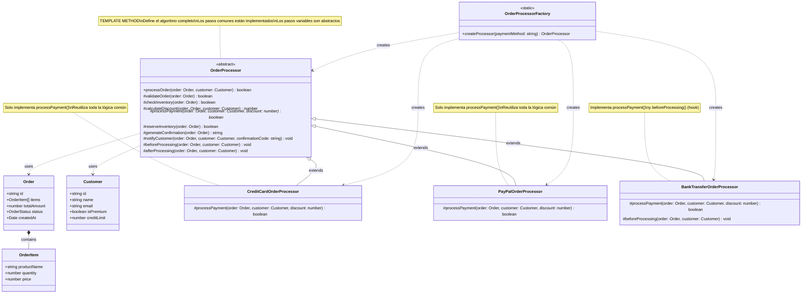

```mermaid
classDiagram
    class Order {
        +string id
        +OrderItem[] items
        +number totalAmount
        +OrderStatus status
        +Date createdAt
    }

    class Customer {
        +string id
        +string name
        +string email
        +boolean isPremium
        +number creditLimit
    }

    class OrderItem {
        +string productName
        +number quantity
        +number price
    }

    class OrderProcessor {
        <<abstract>>
        +processOrder(order: Order, customer: Customer) boolean
        #validateOrder(order: Order) boolean
        #checkInventory(order: Order) boolean
        #calculateDiscount(order: Order, customer: Customer) number
        #processPayment(order: Order, customer: Customer, discount: number)* boolean
        #reserveInventory(order: Order) boolean
        #generateConfirmation(order: Order) string
        #notifyCustomer(order: Order, customer: Customer, confirmationCode: string) void
        #beforeProcessing(order: Order, customer: Customer) void
        #afterProcessing(order: Order, customer: Customer) void
    }

    class CreditCardOrderProcessor {
        #processPayment(order: Order, customer: Customer, discount: number) boolean
    }

    class PayPalOrderProcessor {
        #processPayment(order: Order, customer: Customer, discount: number) boolean
    }

    class BankTransferOrderProcessor {
        #processPayment(order: Order, customer: Customer, discount: number) boolean
        #beforeProcessing(order: Order, customer: Customer) void
    }

    class OrderProcessorFactory {
        <<static>>
        +createProcessor(paymentMethod: string) OrderProcessor
    }

    OrderProcessor <|-- CreditCardOrderProcessor : extends
    OrderProcessor <|-- PayPalOrderProcessor : extends
    OrderProcessor <|-- BankTransferOrderProcessor : extends

    OrderProcessor ..> Order : uses
    OrderProcessor ..> Customer : uses
    Order *-- OrderItem : contains

    OrderProcessorFactory ..> OrderProcessor : creates
    OrderProcessorFactory ..> CreditCardOrderProcessor : creates
    OrderProcessorFactory ..> PayPalOrderProcessor : creates
    OrderProcessorFactory ..> BankTransferOrderProcessor : creates

    note for OrderProcessor "TEMPLATE METHOD\nDefine el algoritmo completo\nLos pasos comunes están implementados\nLos pasos variables son abstractos"
    note for CreditCardOrderProcessor "Solo implementa processPayment()\nReutiliza toda la lógica común"
    note for PayPalOrderProcessor "Solo implementa processPayment()\nReutiliza toda la lógica común"
    note for BankTransferOrderProcessor "Implementa processPayment()\ny beforeProcessing() (hook)"
```