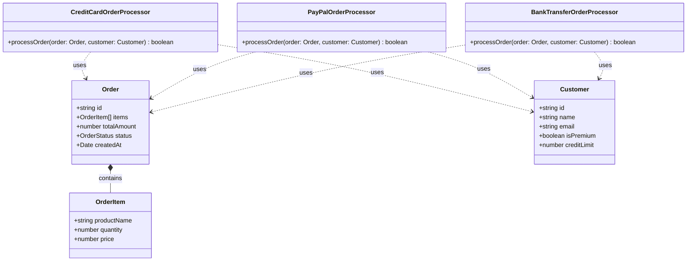

```mermaid
classDiagram
    class Order {
        +string id
        +OrderItem[] items
        +number totalAmount
        +OrderStatus status
        +Date createdAt
    }

    class Customer {
        +string id
        +string name
        +string email
        +boolean isPremium
        +number creditLimit
    }

    class OrderItem {
        +string productName
        +number quantity
        +number price
    }

    class CreditCardOrderProcessor {
        +processOrder(order: Order, customer: Customer) boolean
    }

    class PayPalOrderProcessor {
        +processOrder(order: Order, customer: Customer) boolean
    }

    class BankTransferOrderProcessor {
        +processOrder(order: Order, customer: Customer) boolean
    }

    CreditCardOrderProcessor ..> Order : uses
    CreditCardOrderProcessor ..> Customer : uses
    PayPalOrderProcessor ..> Order : uses
    PayPalOrderProcessor ..> Customer : uses
    BankTransferOrderProcessor ..> Order : uses
    BankTransferOrderProcessor ..> Customer : uses
    Order *-- OrderItem : contains
```